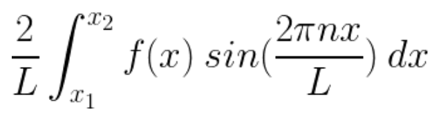

## Design by Plan, Design by Bounded Area and Design by Proximity

### Design by Plan

Design by plan is a stage where an analysis of latent space is conducted. Latent space analysis may involve factor analysis or other supported techniques. 

A simple explanation has been provided here:

<!---
(\frac{2}{L} \int_{x_1}^{x_2} f(x) \: cos(\frac{2\pi nx}{L}) \: dx)
-->

Here, lambda is the factor containing the latent variables. The factor model is a representation of separation of concerns. 

### Design by Bounded Area

Design by bounded area is a stage where an analysis of bounded solutions is conducted. The bounded solutions consider transient states that make up the solution. The metrics that are necessary for evaluating the bounded area for its feasibility are line integrals. 

These contour integrals can be:

(1) Circulation
(2) Flux

Circulation is the contour integral of the tangential component of the flow function, whereas flux is the contour integral of the normal component of the flow function. 

Bounded Areas can be formulated using moving or stationary points such as a Lagrangian. 

### Design by Proximity

Proximity, as it is defined, are weights within a mapping matrix. These weights denote the dynamics of the problem to be solved. The weights could lie either within the time domain of the data in context or its frequency domain. 

TPCC (Ternary Point Configuration Calculus) is a popular technique which can be used for modeling proximity. Proximity involves neighborhood modeling such that it is best fit against an estimated function, curve or data points or time series. 

An example of application of design by proximity shown here is derived using gradient descent the best fit coefficients that satisfy a given function `f(x)`

#

**Case Management Improvement Team**
### **CLIENT CASE MANAGEMENT Lead Discussing with Regards to CLEAN CODE MANAGEMENT for a BUILDING SURVEILLANCE and FURTHER METRICS UTILIZED during the COURSE of ACTION.**

##### Issue Register

###### The Complaint

###### Communication Strategy

